编译原理复习：

### chapter1：

重点：编译系统的结构以及编译程序的生成

难点：编译程序的生成

(ps:以下部分都不用记，只是为了回忆一下实验和理论的交叉部分，从整体上理解编译原理所干的事情)

1.编译程序的理解：将源程序完整地转换为机器语言程序或者汇编语言程序，然后在处理执行的编译程序。

一般是高级程序语言到汇编或者机器语言程序的过程

2.编译程序的总体结构

**词法分析部分**：从左到右扫描对应的源程序的字符串，便将其转化为token串，同时要检查语法错误，进行token串的登记

输入：字符串

输出：token串即（种别码，属性值）

**语法分析部分**：实现组词成句，将各个次组成各类语法成分，构建对应的分析树，指出语法错误，最终指导翻译。

输入：token序列

输出：语法成分

**语义分析部分**：一般和语法分析同时进行，称为语法制导翻译（SDT），功能是分析语法分析器分析出来的语法成分的语义。

获取标志符的属性包括类型作用域等等

语义检查：运算的合法性、取值范围等等

子程序的静态绑定：代码的相对位置

变量的静态绑定：数据的相对地址

**中间代码生成**：

中间代码的特点是：简单规范，与机器无关，易于转化和优化

**代码优化**：

是指对中间代码进行优化处理，使程序运行能够尽量节省存储空间，更加高效的利用机器资源使得程序的运行速度更快，效率更高。

其中包括了局部优化，包括常量合并，例如常数运算什么的，公共子表达式的提取

循环优化等等

更多的还包括了与机器有关优化

最后一个比较重要的是**目标代码生成**，将中间代码转换为目标机器上面的机器指令或者是汇编代码

目标代码的形式包括具有绝对地址的机器指令，汇编语言形式的目标代码，以及模块化的链接结构等

其他不重要还包括各种表格管理包括什么符号表呀，查找、填写源程序里面出现的符号以及编译程序里面生成的符号，为编译的各个阶段提供信息，例如：辅助语法检查，语义检查，完成静态绑定等过程。

还有一个出错管理是进行各种错误的检查、报告还有纠正

词法上：拼写错误；语义上：语句结构、表达式结构；语义上：类型不匹配、参数不匹配；

3.T型图（可能考）

主要有三种一种是不同语言的编译例如已经有A机上java的编译器，现在如何用T型图表示c的编译器

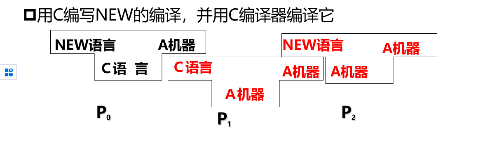

一种是自展的实现，如果在从无到有的基础上实现一个C语言的编译器（只是看起来一无所有罢了，但是实际上还是有一个本地实现的汇编语言到机器语言的编译器的。）

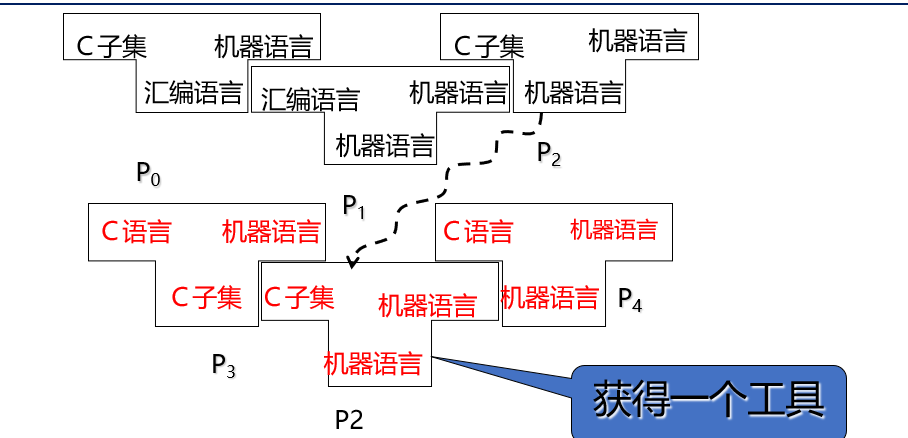

然后是机器之间的编译器迁移，涉及到交叉编译，例如已知A机上面JAVA的编译器，现在要实现的是B机上面JAVA的编译器，首先要做的是实现一个用java语言实现的将可以将java编译的程序，然后需要的就是一个交叉编译的工具，如下所示

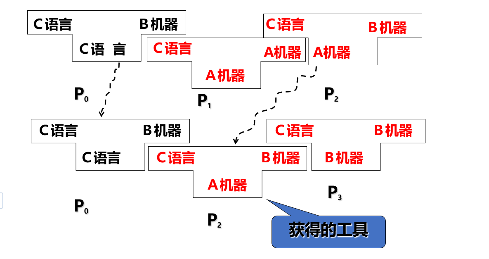

### chapter2：

主要是形式语言自动机的部分回忆。

重点：文法的定义与分类，**CFG的语法以及二义性**，程序设计语言的定义。

难点:   程序设计语言的语义定义。

1.文法的定义以及分类

​	（没有啥特别难的，都是一眼就明白在干啥的）

​	一个需要关注的点是：克林闭包，※表示的是空串加正闭包。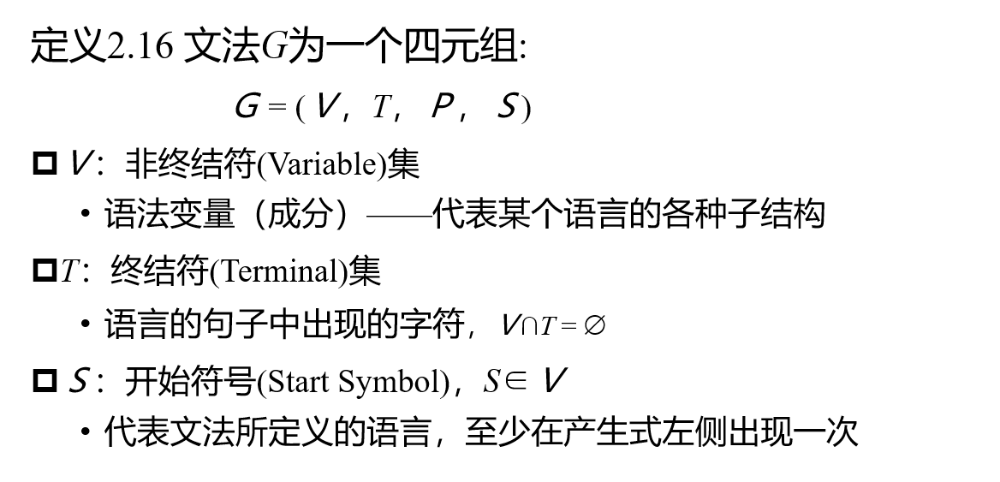

例如如下实例：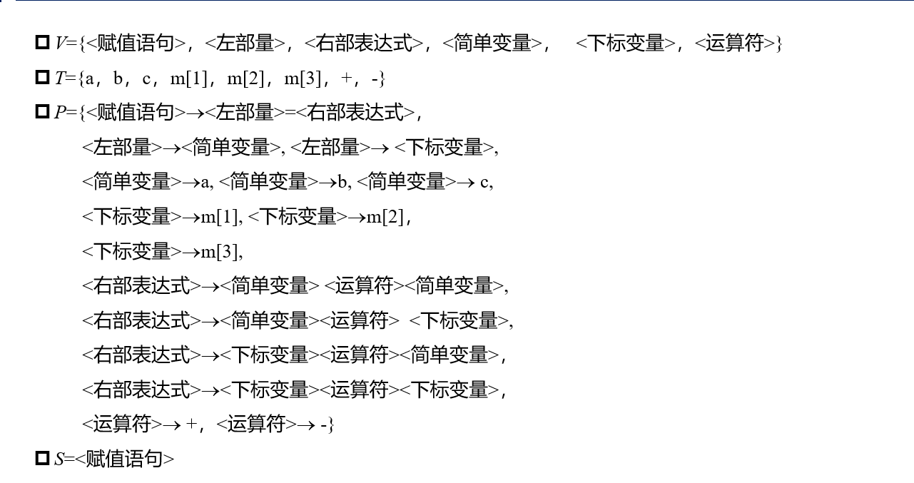

然后就是候选式的概念也就是相同的产生式可以通过“或”连接

概念上有：**推导与归约**（都是依据产生式来的）（其中还有直接推导什么的，更多的是一步推导，对应的还有一步规约，都没有什么太多的变化只需要有以下一个式子表示就可以了）

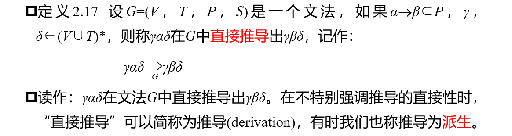

至于语言的定义，其实就是根据文法推导出来的终结符的集合，一个文法对应的有无穷多种句子

**句子与句型**

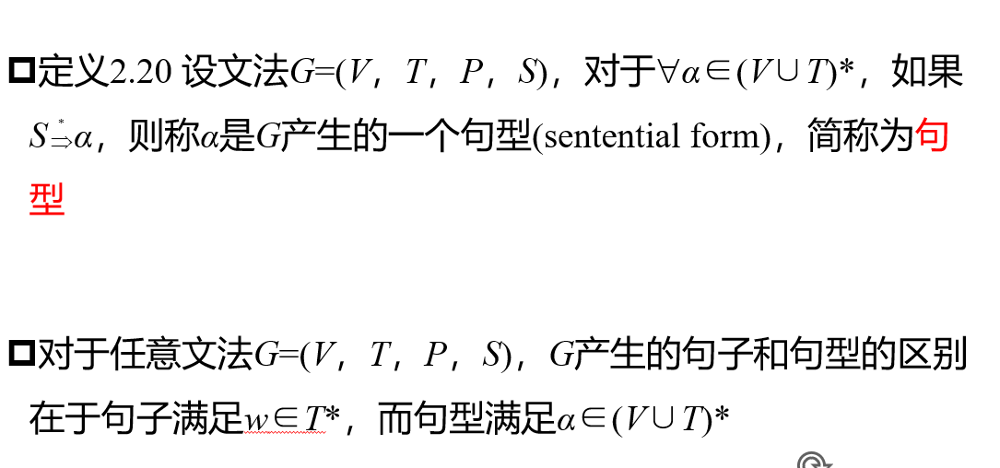

然后就是**chomsky体系**（x型文法）：（应该会有一道选择题）

0型文法：只要满足文法定义的要求就是0型文法（只要这个题出出来了，说明文法一定成立，从而一定至少是0型文法）

1型文法：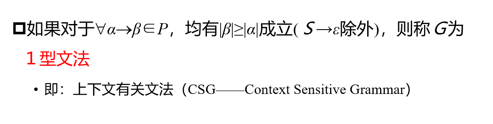

这里对应的就是线性文法，除了空产生式的产生，必须要每一条产生式的右侧长度大于左侧，但是这里没有规定产生式左侧必须是非终结符，因此是和上下文具体内容是有关的，因此称为上下文有关文法

2型文法：

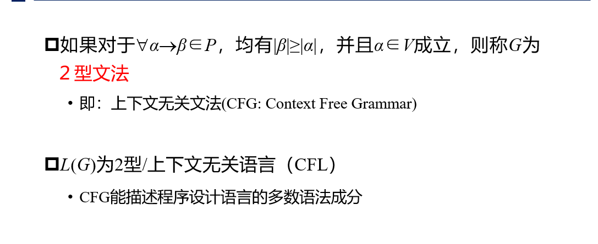

、这里就开始要求产生式的左侧为相应的非终结符了，这样才是上下文无关的语言。

3型语言：（也称正规文法）

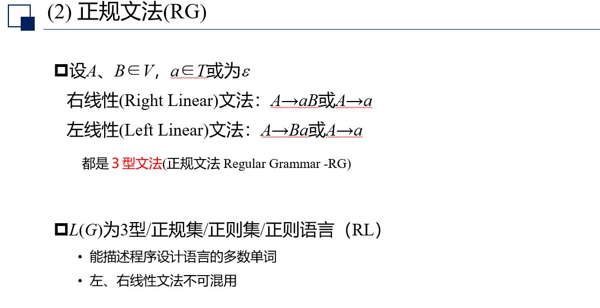

也称正则语言

根据之前学过的部分形式语言与自动机的知识，有些文法或者说语言是不能用上下文无关语言描述的比如回文{wcw}这样的语句就无法通过CFG来描述，更比如那种检查参数个数的抽象文法表示等等

这里的常见考法就是给出一个语言然后问是属于那种文法

**语法分析树的画法**（这里应该会考一个计算或者简答的大题）

常见的考法是对于一个文法，需要给很出对应的最左推导或者是最右推导或者说是规约（这个也并不是很难），虽说不难，但是到时候要注意画的清楚，画的明白些

### **chapter 3**：

**词法分析**

重点：词法分析器的输入、输出，用于识别符号的状态图的构造，根据状态图实现词法分析器

难点：**词法正规文法的表示（大题）**、**正规表达式的表示（一定会出题，可能大题可能填空）、**状态转移图的表示以及转化

总的来说是正式进入了翻译程序的第一步，需要的是将正常的高级语言程序的字符串通过相应的正则文法或者是自动机的识别，来实现对应token串最终的接受（本质上还是形式语言与自动机那一套重点还是说如何构建自动机）。（其中是删去了空格和注释）

有点像当时的形式语言与自动机考试正则语言的部份，多看一下习题

功能：输入源程序，输出token串，即将源程序的字符串转化为等价的单词序列

**token串的种类**：

关键字：一般包括begin、end、for、do、return什么的都是提前约定登记好的

标志符：是用户自己定义的，特制的是用户自己申请的一系列变量名

常数：这里的常数指的包括各种常数，什么小数、整数、布尔常数、字符串常数什么的

运算符：加减乘除，逻辑运算符以及一些关系运算符

分界符：，、；（）等等

**token串存储的格式：**

种别+属性值

小点：

1.以语法分析器为中心的优点：

简化编译器的设计，提高翻译器的效率，增强编译器的可移植性

2.如果词法分析阶段出错了，可以采用紧急方式恢复，也就是反复删除剩余输入最前面的字符。知道词法分析器能发现一个正常的单词为止。

#### **重点：单词的描述，也就是说如何设计一个正则文法使得它能够识别一个token字符串**

实验部分也问到了这个问题，本身挺抽象的，因为每个人设计的都会有细微的差别，而且无论怎么写都有可能漏掉某种自己当时没太考虑全面的地方，但既然考了，应该就是想试着看一下到底有没有理解自动机和词法分析的过程，也算是核心问题了。

下面常见的几个不同进制的数字无符号整数表示方式

十进制：dec->(1|..|9)(0|...|9)*

八进制：oct->0（0|1|。。。|7）（0|1|...|7）*

三种综合

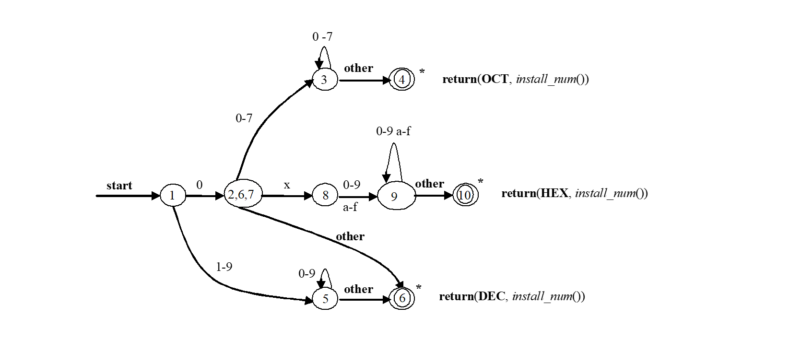

多种综合（感觉还是很有可能考一个这样的图的，基本上把状态机和对应的文法都考到了）

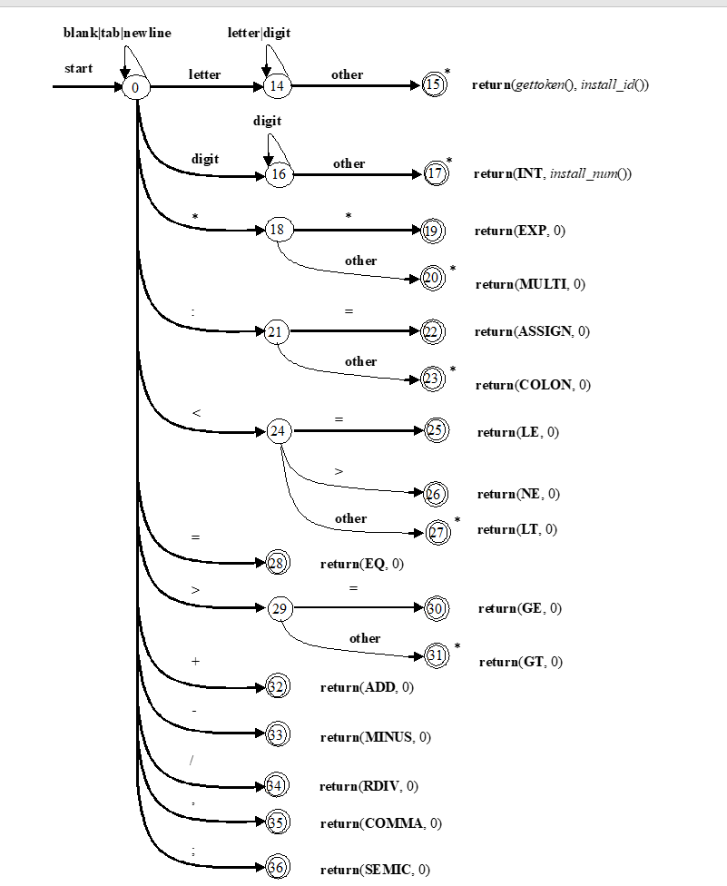

至于算法就是看图写算法啦！应该还是比较好写的，还真有可能出对应的算法题。（ppt上有对应的示例，这里就不再展示了，是很结合图一步一步的case就很容易写出来了）

其中有一点忘记提到的是为了提高扫描效率，词法分析器采用的的是缓冲奇数，而且在将字符流读入缓冲区时，是经过剔除注解以及无用空白符后等预处理后的源代码

### chapter4：

**自顶向下的语法分析**

这个是本门课程的核心部分之一了，因为上承的是一些形式语言自动机的部分知识，下面的语义分析多依赖的是这里的结构，中间代码生成更多的是算法设计，最后一些部分是跟平台架构相关的部分。不仅是最能考出内容的部分，同时也是相对来说比较难的一部分。

重点：自顶向下分析的基本思想，预测分析器的总体结构，**预测分析表的构造**（必考大题），递归下降分析法的基本思想，算数表达式的递归下降分析器。

难点：**FIRST集、FOLLOW集的求法以及他们在构造LL（1）分析表时候的使用**（必考大题），递归子程序法中如何体现分析的结果。

无论如何一定要熟练掌握FIRST集、FOLLOW集等的用法，这是理论必考的内容出题形式，如同作业

